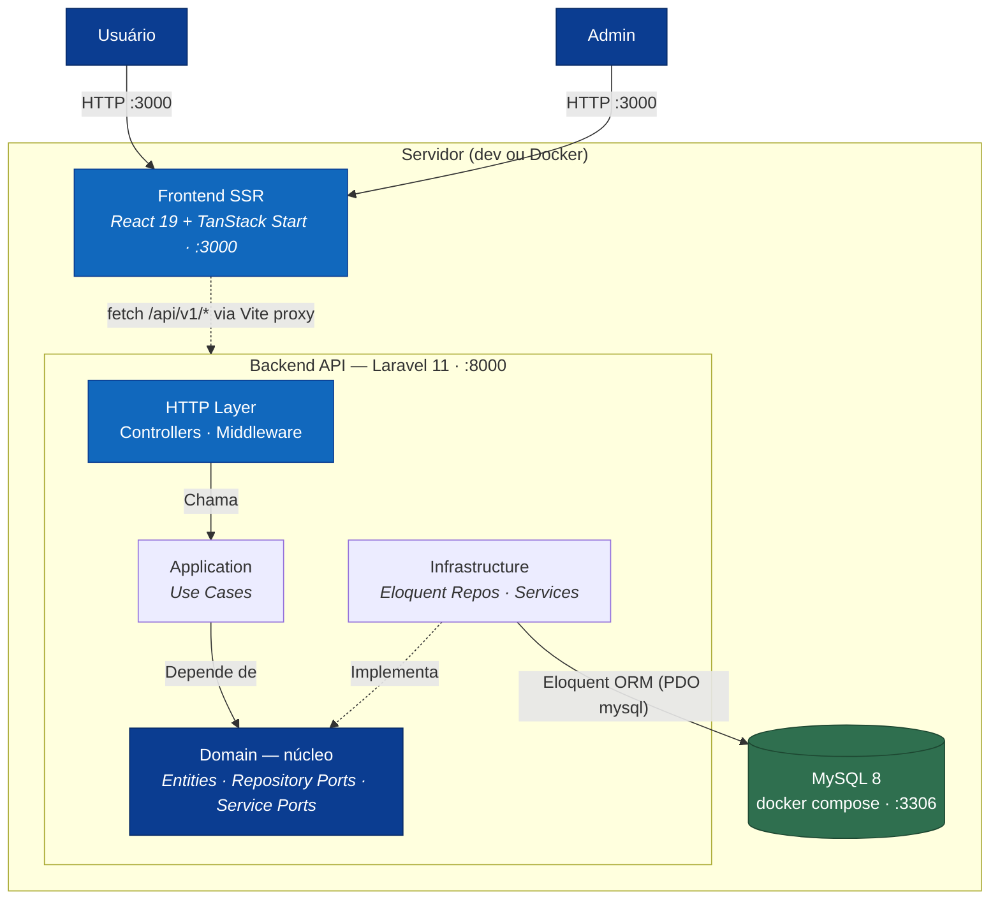
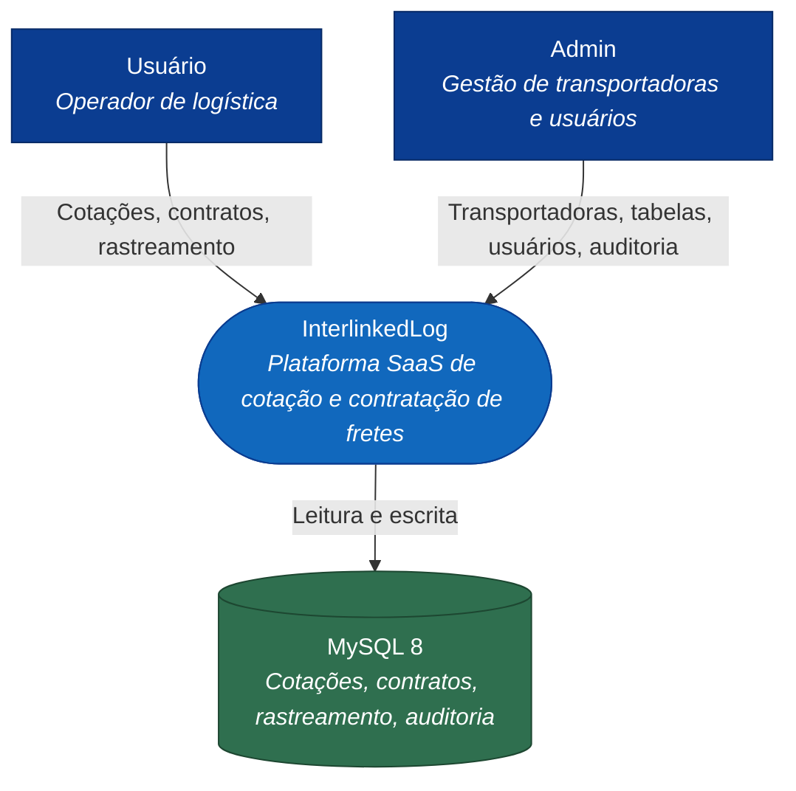
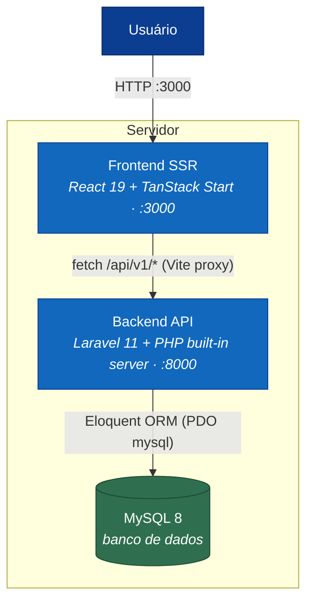
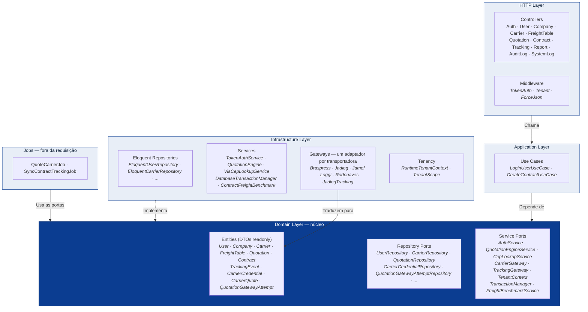

# 01 — Arquitetura do Sistema

## Visão unificada do sistema

Diagrama que consolida os três níveis do C4 num só lugar: atores externos, o
**servidor de desenvolvimento** (Backend Laravel + Frontend TanStack Start) e o banco **MySQL 8** — com o
Backend "aberto" mostrando as camadas da arquitetura hexagonal por dentro. As setas
internas representam a **direção da dependência** (tudo aponta para o Domain).



---

## C4 Model — Nível 1: System Context



---

## C4 Model — Nível 2: Containers



---

## C4 Model — Nível 3: Componentes (Arquitetura Hexagonal)

> As setas representam a **direção da dependência**. O Domain não depende de nenhuma
> outra camada; Infrastructure e HTTP dependem do Domain.



### Regra de dependência

| Camada | Pode importar | NÃO pode importar |
|--------|---------------|-------------------|
| **Domain** | stdlib PHP, `Domain/*` | `Application`, `Infrastructure`, `Http` |
| **Application** | `Domain/*` | `Infrastructure`, `Http` |
| **Infrastructure** | `Domain/*`, `Application/*`, Eloquent, frameworks | — |
| **Http (Controllers)** | `Application/*`, `Domain/*`, Laravel | `App\\Models\\*` direto |
| **Jobs** | `Domain/*`, Laravel | acesso a Eloquent fora das portas |

Além disso, a fachada `DB` só pode ser usada em `Infrastructure` — quem define a
fronteira de transação é a aplicação, através da porta `TransactionManager`, mas
quem a executa é a infraestrutura.

**Estas regras são verificadas automaticamente** pelo PHPat (`phpstan.arch.neon`)
e por testes que inspecionam o schema, em `tests/Feature/ArchitectureTest.php` —
incluindo a de tenancy: todo model com coluna `company_id` deve usar o trait
`TenantScoped`.

---

## Fluxo de uma cotação (`POST /api/v1/quotations`)

A cotação tem duas metades: o que responde na hora e o que chega depois.

```
SÍNCRONO — dentro da requisição
 1. Frontend faz POST /api/v1/quotations (Authorization: Bearer {token})
 2. O servidor SSR do frontend faz proxy de /api/* para o nginx do backend
 3. TokenAuthMiddleware valida o token e alimenta o TenantContext
 4. TenantMiddleware confirma que há company_id no contexto
 5. QuotationController::store() valida a entrada
 6. CepLookupService resolve os CEPs (mapa local, senão ViaCEP com cache)
 7. QuotationEngine::process() cota nas TABELAS locais do tenant:
      rota casada → faixa de peso → frete + taxas → ranking
 8. Persiste a cotação e os resultados de tabela
 9. Para cada credencial ativa: grava tentativa 'pendente' e despacha
      QuoteCarrierJob (companyId no payload — o worker não tem request HTTP)
10. Responde imediatamente com os resultados de tabela

ASSÍNCRONO — um job por transportadora, no worker
11. QuoteCarrierJob entra com TenantContext::runAs(companyId)
12. CarrierGateway do adaptador consulta a API da transportadora
13. Resultado normalizado em CarrierQuote vira mais uma linha de
      quotation_results, marcada com source='api'
14. A tentativa passa a 'cotada', 'nao_atende', 'indisponivel' ou 'erro'

LEITURA — enquanto os resultados chegam
15. GET /quotations/{id} devolve results (reordenados a cada leitura),
      carriers.pending, carriers.attempts e o benchmark histórico
```

**Por que assíncrono:** as tabelas são consulta em banco e respondem em
milissegundos; a Rodonaves sozinha faz quatro chamadas HTTP em três hosts. Um
job por transportadora isola a lentidão e a falha — uma API fora do ar não
atrasa nem derruba as demais.

---

## Isolamento de tenant

O escopo é aplicado por `TenantScope` nos models com `company_id`, lendo o tenant
ativo do `TenantContext` — uma porta de domínio com implementação de processo.

Quem define o tenant é explícito: o `TokenAuthMiddleware` em HTTP, e o job na
fila via `runAs()`. Antes o escopo lia do binding de request e ficava **inerte
fora de HTTP**, o que tornava o worker cego para a separação entre empresas.

Três consultas ignoram o escopo deliberadamente, porque são **anteriores** ao
estabelecimento do tenant: `findByEmail` (login), `findByToken` e `setToken`.

---

---

## Estrutura de diretórios

```
InterlinkedLog/
├── backend/                         # Laravel 11 (PHP)
│   ├── app/
│   │   ├── Application/
│   │   │   └── UseCases/Auth/       # LoginUserUseCase, RegisterUserUseCase
│   │   ├── Domain/
│   │   │   ├── Entities/            # DTOs imutáveis (readonly properties)
│   │   │   ├── Repositories/        # Interfaces de repositório (Ports)
│   │   │   └── Services/            # Interfaces de serviço (Ports)
│   │   ├── Http/
│   │   │   ├── Controllers/Api/     # REST controllers (11 controllers)
│   │   │   └── Middleware/          # TokenAuth, Tenant, ForceJson
│   │   ├── Infrastructure/
│   │   │   ├── Repositories/Eloquent/ # 10 implementações Eloquent
│   │   │   └── Services/            # TokenAuthService, QuotationEngine, ReportGenerator
│   │   ├── Models/                  # Eloquent Models (ORM)
│   │   └── Providers/
│   ├── database/
│   │   ├── migrations/              # 19 migrations (criação completa do schema)
│   │   ├── seeders/                 # DatabaseSeeder (seed inicial com admin)
│   │   └── scripts/                 # migrate-sqlite-to-mysql.php (migração legada)
│   ├── resources/views/pdf/         # Template Blade para PDF de Solicitação de Coleta
│   ├── routes/api.php               # Definição das rotas REST
│   ├── docker-entrypoint.sh         # Espera o MySQL e sobe o serve
│   └── Dockerfile                   # Imagem PHP com pdo_mysql/pdo_sqlite
│
├── src/                             # Frontend React (TanStack Start)
│   ├── routes/                      # File-based routing (TanStack Router)
│   ├── components/ui/               # Primitivos shadcn/ui (Radix)
│   ├── shared/components/           # Átomos, Moléculas, Organismos
│   ├── hooks/                       # useAuth
│   └── lib/                         # api.ts, utils, config
│
├── docker-compose.yml               # Orquestra mysql (:3306) + backend (:8080) + frontend (:3000)
├── mysql-init/init.sql              # Cria interlinkedlog_test na 1ª subida
├── scripts/                         # backup-mysql.sh, restore-mysql.sh
├── start.sh                         # Sobe backend + frontend em dev
├── stop.sh                          # Para todos os processos
└── test-all.sh                      # 30 testes automatizados via curl
```
