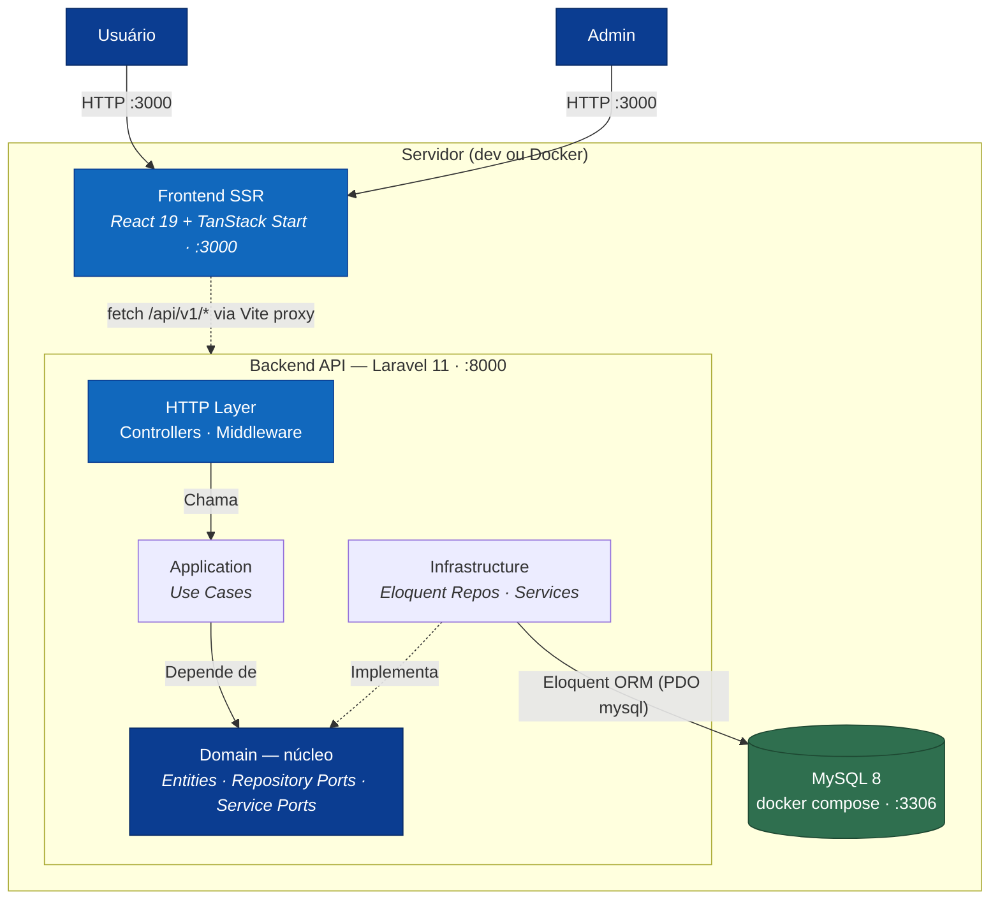
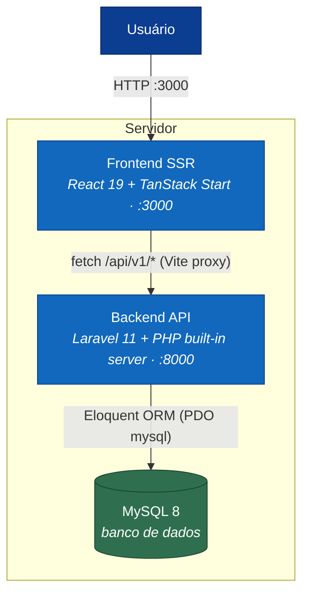
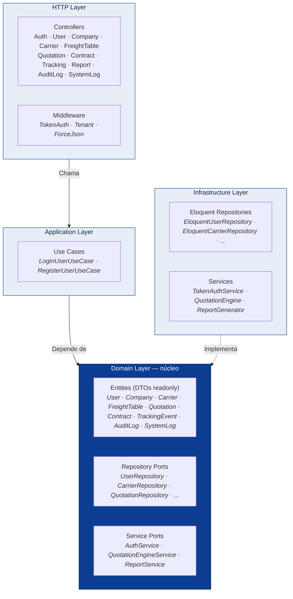

# 01 — Arquitetura do Sistema

## Visão unificada do sistema

Diagrama que consolida os três níveis do C4 num só lugar: atores externos, o
**servidor de desenvolvimento** (Backend Laravel + Frontend TanStack Start) e o banco **MySQL 8** — com o
Backend "aberto" mostrando as camadas da arquitetura hexagonal por dentro. As setas
internas representam a **direção da dependência** (tudo aponta para o Domain).



---

## C4 Model — Nível 1: System Context


---

## C4 Model — Nível 2: Containers



---

## C4 Model — Nível 3: Componentes (Arquitetura Hexagonal)

> As setas representam a **direção da dependência**. O Domain não depende de nenhuma
> outra camada; Infrastructure e HTTP dependem do Domain.



### Regra de dependência

| Camada | Pode importar | NÃO pode importar |
|--------|---------------|-------------------|
| **Domain** | stdlib PHP, `Domain/*` | `Application`, `Infrastructure`, `Http` |
| **Application** | `Domain/*` | `Infrastructure`, `Http` |
| **Infrastructure** | `Domain/*`, `Application/*`, Eloquent, frameworks | — |
| **Http (Controllers)** | `Application/*`, `Domain/*`, `Infrastructure/*`, Laravel | — |

---

## Fluxo de uma requisição (ex: `POST /api/v1/quotations`)

```
1. Frontend faz fetch POST /api/v1/quotations (Authorization: Bearer {token})
2. Vite proxy redireciona para Laravel :8000
3. TokenAuthMiddleware valida o token — extrai user_id + company_id
4. TenantMiddleware injeta company_id no request
5. ForceJsonMiddleware garante Content-Type application/json + CORS
6. QuotationController::store() recebe o request validado
7. QuotationEngine::process() calcula frete para cada transportadora ativa
8.   - Converte CEPs em cidades
9.   - Busca FreightTable ativa para rota origem → destino
10.  - Encontra faixa de peso, calcula base + taxas
11.  - Aplica frete mínimo
12.  - Ordena resultados por preço, prazo, custo-benefício
13. EloquentQuotationRepository::save() persiste Quotation + QuotationResults no MySQL (em transação)
14. Response JSON retorna cotação com ranking de transportadoras
```

---

## Estrutura de diretórios

```
InterlinkedLog/
├── backend/                         # Laravel 11 (PHP)
│   ├── app/
│   │   ├── Application/
│   │   │   └── UseCases/Auth/       # LoginUserUseCase, RegisterUserUseCase
│   │   ├── Domain/
│   │   │   ├── Entities/            # DTOs imutáveis (readonly properties)
│   │   │   ├── Repositories/        # Interfaces de repositório (Ports)
│   │   │   └── Services/            # Interfaces de serviço (Ports)
│   │   ├── Http/
│   │   │   ├── Controllers/Api/     # REST controllers (11 controllers)
│   │   │   └── Middleware/          # TokenAuth, Tenant, ForceJson
│   │   ├── Infrastructure/
│   │   │   ├── Repositories/Eloquent/ # 10 implementações Eloquent
│   │   │   └── Services/            # TokenAuthService, QuotationEngine, ReportGenerator
│   │   ├── Models/                  # Eloquent Models (ORM)
│   │   └── Providers/
│   ├── database/
│   │   ├── migrations/              # 19 migrations (criação completa do schema)
│   │   ├── seeders/                 # DatabaseSeeder (seed inicial com admin)
│   │   └── scripts/                 # migrate-sqlite-to-mysql.php (migração legada)
│   ├── resources/views/pdf/         # Template Blade para PDF de Solicitação de Coleta
│   ├── routes/api.php               # Definição das rotas REST
│   ├── docker-entrypoint.sh         # Espera o MySQL e sobe o serve
│   └── Dockerfile                   # Imagem PHP com pdo_mysql/pdo_sqlite
│
├── src/                             # Frontend React (TanStack Start)
│   ├── routes/                      # File-based routing (TanStack Router)
│   ├── components/ui/               # Primitivos shadcn/ui (Radix)
│   ├── shared/components/           # Átomos, Moléculas, Organismos
│   ├── hooks/                       # useAuth
│   └── lib/                         # api.ts, utils, config
│
├── docker-compose.yml               # Orquestra mysql (:3306) + backend (:8080) + frontend (:3000)
├── mysql-init/init.sql              # Cria interlinkedlog_test na 1ª subida
├── scripts/                         # backup-mysql.sh, restore-mysql.sh
├── start.sh                         # Sobe backend + frontend em dev
├── stop.sh                          # Para todos os processos
└── test-all.sh                      # 30 testes automatizados via curl
```
