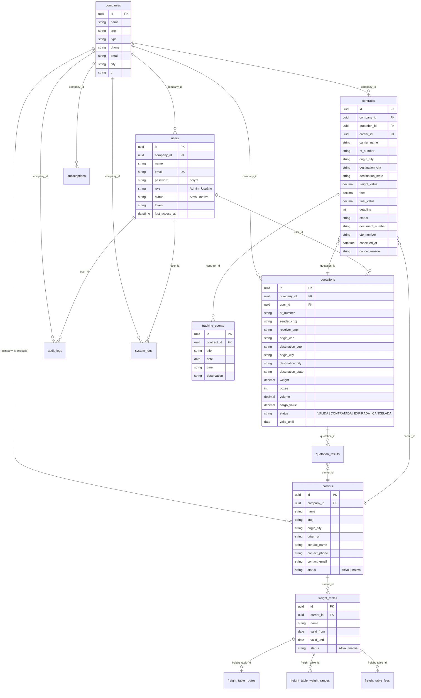

# 03 — Banco de Dados

## Diagrama Entidade-Relacionamento



---

## Tabela: `companies`

Empresa raiz de cada tenant.

| Coluna | Tipo | Null | Descrição |
|--------|------|------|-----------|
| `id` | UUID | N | Chave primária |
| `name` | VARCHAR | N | Razão social |
| `cnpj` | VARCHAR(18) | N | CNPJ formatado |
| `type` | VARCHAR(50) | N | Tipo da empresa |
| `phone` | VARCHAR(20) | S | Telefone |
| `email` | VARCHAR | S | E-mail de contato |
| `city` | VARCHAR | S | Cidade |
| `uf` | VARCHAR(2) | S | Estado |
| `created_at` / `updated_at` | DATETIME | S | Timestamps Laravel |

---

## Tabela: `users`

Usuários do sistema, sempre escopados por `company_id`.

| Coluna | Tipo | Null | Descrição |
|--------|------|------|-----------|
| `id` | UUID | N | Chave primária |
| `company_id` | UUID | N | FK → `companies.id` (cascade delete) |
| `name` | VARCHAR | N | Nome completo |
| `email` | VARCHAR | N | E-mail único |
| `password` | VARCHAR | N | Hash bcrypt |
| `role` | VARCHAR(30) | N | `Admin` ou `Usuário` |
| `status` | VARCHAR(20) | N | `Ativo` ou `Inativo` |
| `token` | VARCHAR | S | Token de sessão atual (64 chars hex) |
| `last_access_at` | TIMESTAMP | S | Último acesso |

**Índices:** PK `id`, UK `email`

---

## Tabela: `carriers`

Transportadoras cadastradas. `company_id` é nullable — transportadoras podem ser compartilhadas globalmente ou ser de um tenant específico.

| Coluna | Tipo | Null | Descrição |
|--------|------|------|-----------|
| `id` | UUID | N | Chave primária |
| `company_id` | UUID | S | FK → `companies.id` (cascade delete) |
| `name` | VARCHAR | N | Nome da transportadora |
| `cnpj` | VARCHAR(18) | N | CNPJ |
| `origin_city` | VARCHAR | N | Cidade de origem operacional |
| `origin_uf` | VARCHAR(2) | N | Estado de origem |
| `contact_name` | VARCHAR | S | Nome do contato |
| `contact_phone` | VARCHAR | S | Telefone do contato |
| `contact_email` | VARCHAR | S | E-mail do contato |
| `status` | VARCHAR(20) | N | `Ativo` ou `Inativo` |

---

## Tabela: `freight_tables`

Tabelas de frete por transportadora.

| Coluna | Tipo | Null | Descrição |
|--------|------|------|-----------|
| `id` | UUID | N | Chave primária |
| `carrier_id` | UUID | N | FK → `carriers.id` (cascade delete) |
| `name` | VARCHAR | N | Nome identificador da tabela |
| `valid_from` | DATE | N | Início da vigência |
| `valid_until` | DATE | N | Fim da vigência |
| `status` | VARCHAR(20) | N | `Ativa` ou `Inativa` |

---

## Tabela: `freight_table_routes`

Rotas cobertas por uma tabela de frete.

| Coluna | Tipo | Descrição |
|--------|------|-----------|
| `id` | UUID | Chave primária |
| `freight_table_id` | UUID | FK → `freight_tables.id` |
| `origin_city` | VARCHAR | Cidade de origem |
| `origin_uf` | VARCHAR(2) | Estado de origem |
| `destination_city` | VARCHAR | Cidade de destino |
| `destination_uf` | VARCHAR(2) | Estado de destino |

---

## Tabela: `freight_table_weight_ranges`

Faixas de peso e valores da tabela de frete.

| Coluna | Tipo | Descrição |
|--------|------|-----------|
| `id` | UUID | Chave primária |
| `freight_table_id` | UUID | FK → `freight_tables.id` |
| `weight_start` | DECIMAL | Início da faixa (kg) |
| `weight_end` | DECIMAL | Fim da faixa (kg) |
| `price` | DECIMAL | Valor do frete para a faixa |
| `deadline` | INT | Prazo em dias |

---

## Tabela: `freight_table_fees`

Taxas adicionais da tabela de frete.

| Coluna | Tipo | Descrição |
|--------|------|-----------|
| `id` | UUID | Chave primária |
| `freight_table_id` | UUID | FK → `freight_tables.id` |
| `fee_type` | VARCHAR(50) | Tipo: `ad_valorem`, `gris`, `despacho`, `pedagio`, `tde`, `frete_minimo`, `cubagem` |
| `value` | DECIMAL(10,2) | Valor da taxa |
| `is_percentage` | BOOLEAN | `true` = % do valor NF; `false` = valor fixo |

---

## Tabela: `quotations`

Cotações de frete geradas pelo sistema.

| Coluna | Tipo | Null | Descrição |
|--------|------|------|-----------|
| `id` | UUID | N | Chave primária |
| `company_id` | UUID | N | FK → `companies.id` |
| `user_id` | UUID | N | FK → `users.id` |
| `nf_number` | VARCHAR(20) | N | Número da Nota Fiscal |
| `sender_cnpj` | VARCHAR(18) | N | CNPJ do remetente |
| `receiver_cnpj` | VARCHAR(18) | N | CNPJ do destinatário |
| `origin_cep` | VARCHAR(10) | N | CEP de origem |
| `destination_cep` | VARCHAR(10) | N | CEP de destino |
| `origin_city` | VARCHAR | N | Cidade de origem (resolvida do CEP) |
| `destination_city` | VARCHAR | N | Cidade de destino (resolvida do CEP) |
| `destination_state` | VARCHAR(2) | N | Estado de destino |
| `weight` | DECIMAL(8,2) | N | Peso em kg |
| `boxes` | INT | N | Número de volumes |
| `volume` | DECIMAL(8,3) | N | Volume em m³ |
| `cargo_value` | DECIMAL(10,2) | N | Valor da mercadoria |
| `status` | VARCHAR(20) | N | `VALIDA`, `CONTRATADA`, `EXPIRADA`, `CANCELADA` |
| `valid_until` | DATE | N | Validade de 7 dias a partir da criação |

**Ciclo de vida do status:**
```
VALIDA (7 dias) → CONTRATADA / EXPIRADA / CANCELADA
```

---

## Tabela: `quotation_results`

Resultados do motor de cotação para cada transportadora.

| Coluna | Tipo | Descrição |
|--------|------|-----------|
| `id` | UUID | Chave primária |
| `quotation_id` | UUID | FK → `quotations.id` |
| `carrier_id` | UUID | FK → `carriers.id` |
| `carrier_name` | VARCHAR | Nome da transportadora (desnormalizado) |
| `freight_value` | DECIMAL(10,2) | Frete base |
| `fees` | DECIMAL(10,2) | Total de taxas |
| `final_value` | DECIMAL(10,2) | Total (frete + taxas, mínimo aplicado) |
| `deadline` | INT | Prazo em dias |
| `fees_breakdown` | JSON | Detalhamento por taxa |

---

## Tabela: `contracts`

Contratos gerados a partir de cotações aprovadas.

| Coluna | Tipo | Null | Descrição |
|--------|------|------|-----------|
| `id` | UUID | N | Chave primária |
| `company_id` | UUID | N | FK → `companies.id` |
| `quotation_id` | UUID | N | FK → `quotations.id` |
| `carrier_id` | UUID | N | FK → `carriers.id` |
| `carrier_name` | VARCHAR | N | Nome (desnormalizado para histórico) |
| `nf_number` | VARCHAR(20) | N | Número da NF |
| `origin_city` | VARCHAR | N | Cidade de origem |
| `destination_city` | VARCHAR | N | Cidade de destino |
| `destination_state` | VARCHAR(2) | N | Estado de destino |
| `freight_value` | DECIMAL(10,2) | N | Frete base contratado |
| `fees` | DECIMAL(10,2) | N | Taxas contratadas |
| `final_value` | DECIMAL(10,2) | N | Valor total do contrato |
| `deadline` | INT | N | Prazo contratado em dias |
| `status` | VARCHAR(30) | N | `Aguardando Transportadora`, `Em Andamento`, `Entregue`, `Cancelado` |
| `document_number` | VARCHAR | N | Número do documento de coleta |
| `cte_number` | VARCHAR | S | CT-e (registrado após emissão pela transportadora) |
| `cancelled_at` | TIMESTAMP | S | Data/hora do cancelamento |
| `cancel_reason` | VARCHAR | S | Motivo do cancelamento |

---

## Tabela: `tracking_events`

Eventos de rastreamento vinculados a contratos.

| Coluna | Tipo | Null | Descrição |
|--------|------|------|-----------|
| `id` | UUID | N | Chave primária |
| `contract_id` | UUID | N | FK → `contracts.id` (cascade delete) |
| `title` | VARCHAR | N | Status livre (qualquer texto) |
| `date` | DATE | N | Data do evento |
| `time` | VARCHAR | N | Hora do evento (HH:MM) |
| `observation` | VARCHAR | S | Observação adicional |

---

## Tabela: `audit_logs`

Trilha de auditoria de ações dos usuários.

| Coluna | Tipo | Null | Descrição |
|--------|------|------|-----------|
| `id` | UUID | N | Chave primária |
| `company_id` | UUID | N | FK → `companies.id` |
| `user_id` | UUID | N | FK → `users.id` |
| `user_name` | VARCHAR | N | Nome do usuário (desnormalizado) |
| `module` | VARCHAR | N | Módulo afetado (ex: `quotations`) |
| `action` | VARCHAR | N | Ação executada (ex: `create`, `cancel`) |
| `entity_type` | VARCHAR | N | Tipo da entidade |
| `entity_id` | UUID | S | ID da entidade afetada |
| `old_values` | TEXT | S | JSON com valores anteriores |
| `new_values` | TEXT | S | JSON com novos valores |
| `created_at` | TIMESTAMP | S | Data/hora do evento |

---

## Tabela: `system_logs`

Logs técnicos do sistema.

| Coluna | Tipo | Descrição |
|--------|------|-----------|
| `id` | UUID | Chave primária |
| `company_id` | UUID | FK → `companies.id` |
| `user_id` | UUID | FK → `users.id` |
| `user_name` | VARCHAR | Nome do usuário |
| `level` | VARCHAR | `info`, `warning`, `error` |
| `event` | VARCHAR | Tipo do evento |
| `message` | TEXT | Mensagem descritiva |

---

## Tabela: `subscriptions`

Assinaturas de plano por empresa (estrutura preparada para SaaS).

| Coluna | Tipo | Descrição |
|--------|------|-----------|
| `id` | UUID | Chave primária |
| `company_id` | UUID | FK → `companies.id` |
| `plan_name` | VARCHAR | Nome do plano |
| `price` | DECIMAL(10,2) | Preço mensal |
| `status` | VARCHAR(20) | `Ativa` ou `Inativa` |
| `due_date` | DATE | Data de vencimento |

---

## Migrations

14 migrations criadas em `2026-06-16`, executadas em ordem sequencial:

| # | Migration | O que cria |
|---|-----------|-----------|
| 001 | `create_companies_table` | Tabela `companies` |
| 002 | `create_users_table` | Tabela `users` (FK companies) |
| 003 | `create_carriers_table` | Tabela `carriers` (FK companies) |
| 004 | `create_freight_tables_table` | Tabela `freight_tables` (FK carriers) |
| 005 | `create_freight_table_routes_table` | Tabela `freight_table_routes` |
| 006 | `create_freight_table_weight_ranges_table` | Tabela `freight_table_weight_ranges` |
| 007 | `create_freight_table_fees_table` | Tabela `freight_table_fees` |
| 008 | `create_subscriptions_table` | Tabela `subscriptions` |
| 009 | `create_quotations_table` | Tabela `quotations` (FK companies, users) |
| 010 | `create_quotation_results_table` | Tabela `quotation_results` (FK quotations, carriers) |
| 011 | `create_contracts_table` | Tabela `contracts` (FK companies, quotations, carriers) |
| 012 | `create_tracking_events_table` | Tabela `tracking_events` (FK contracts) |
| 013 | `create_audit_logs_table` | Tabela `audit_logs` (FK companies, users) |
| 014 | `create_system_logs_table` | Tabela `system_logs` (FK companies, users) |

### Comandos

```bash
# Aplicar todas as migrations
cd backend
php artisan migrate

# Rollback completo
php artisan migrate:rollback --step=14

# Recriar banco do zero (dev)
php artisan migrate:fresh

# Seed após migrate
php artisan app:seed
# ou via start.sh que faz ambos automaticamente
```
