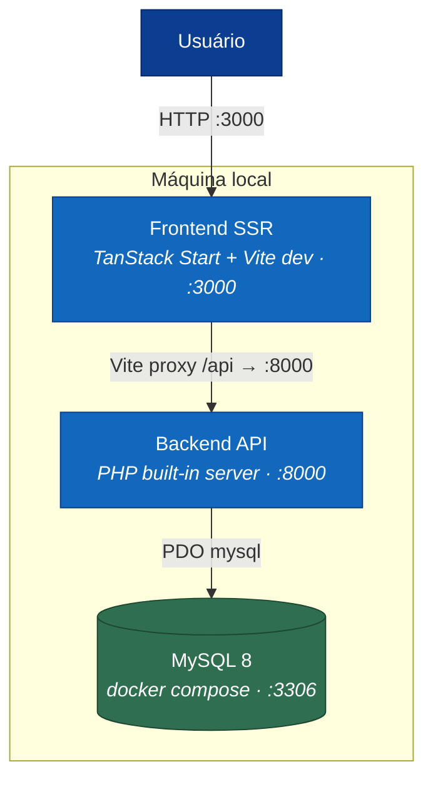
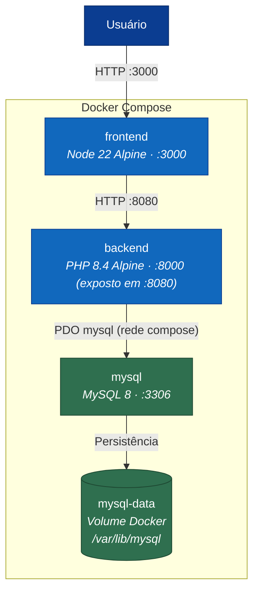

# 06 — Infraestrutura

## Diagrama de Deploy

### Modo Desenvolvimento (padrão)



### Modo Docker



---

## Docker Compose (`docker-compose.yml`)

| Serviço | Imagem | Porta host | Porta container | Descrição |
|---------|--------|-----------|----------------|-----------|
| `mysql` | `mysql:8` | 3306 | 3306 | Banco de dados (volume `mysql-data`) |
| `backend` | `./backend` (PHP 8.4 Alpine) | 8080 | 8000 | Laravel + MySQL |
| `frontend` | `.` (Node 22 Alpine) | 3000 | 3000 | TanStack Start dev |

### Healthchecks

```yaml
# mysql — aguardado pelo backend (depends_on: condition: service_healthy)
healthcheck:
  test: mysqladmin ping -h 127.0.0.1 -uroot -p$$MYSQL_ROOT_PASSWORD --silent
  interval: 5s
  timeout: 5s
  retries: 20
  start_period: 30s

# backend — aguardado pelo frontend (depends_on: condition: service_healthy)
healthcheck:
  test: curl -sf http://localhost:8000/up || exit 1
  interval: 10s
  timeout: 5s
  retries: 5
  start_period: 30s
```

O backend ainda espera o MySQL com retry/backoff no `docker-entrypoint.sh`
(30 tentativas × 2s) antes de rodar `migrate`, além do healthcheck do compose.

### Volumes

```yaml
volumes:
  mysql-data:      # Persiste /var/lib/mysql entre reinicializações do container
```

O `mysql-init/init.sql` roda na primeira inicialização do volume e cria o
banco de teste `interlinkedlog_test` (usado pela suíte PHPUnit).

---

## Dockerfiles

### Backend (`backend/Dockerfile`)

```dockerfile
FROM php:8.4-cli-alpine

RUN apk add --no-cache sqlite-dev curl \
    && docker-php-ext-install pdo pdo_sqlite pdo_mysql

WORKDIR /app
COPY . .

RUN curl -sS https://getcomposer.org/installer | php -- --install-dir=/usr/local/bin --filename=composer \
    && composer config --global policy.advisories.block false \
    && composer install --no-dev --no-interaction --optimize-autoloader

EXPOSE 8000
CMD ["sh", "docker-entrypoint.sh"]
```

- Usa `php:8.4-cli-alpine` (imagem mínima)
- Instala extensões `pdo`, `pdo_sqlite` (migração de dados legada) e `pdo_mysql`
- **Não grava `.env` na imagem** — toda a configuração vem do ambiente do compose
- `docker-entrypoint.sh` espera o MySQL (retry/backoff), roda `migrate --force`,
  semeia apenas com o banco vazio (checagem de `companies`) e sobe o `artisan serve`

### Frontend (`Dockerfile`)

```dockerfile
FROM node:22-alpine

WORKDIR /app
COPY package.json package-lock.json ./
RUN npm install
COPY . .

EXPOSE 3000
CMD npm run dev -- --host 0.0.0.0
```

---

## Scripts de operação

### `start.sh` — Subir ambiente de desenvolvimento

1. Libera portas :8000 e :3000 (mata processos existentes)
2. Executa seed do banco (`php artisan app:seed`)
3. Inicia PHP built-in server em `127.0.0.1:8000` (background, PID salvo em `.pids/backend.pid`)
4. Detecta bun ou npm e inicia frontend em `:3000` (background, PID salvo em `.pids/frontend.pid`)
5. Aguarda 5 segundos e exibe URLs de acesso

```bash
./start.sh
# Frontend: http://localhost:3000
# Backend:  http://localhost:8000/api/v1
# Login:    admin@interlinked.io / admin123
```

### `stop.sh` — Parar ambiente

```bash
./stop.sh    # Lê .pids/*.pid e mata os processos
```

### `docker-start.sh` — Subir via Docker Compose

```bash
./docker-start.sh    # docker compose up --build -d
```

### `docker-stop.sh` — Parar Docker

```bash
./docker-stop.sh    # docker compose down
```

### `test-all.sh` — Suite de testes (30 cenários curl)

```bash
./test-all.sh
# Executa 30 testes cobrindo todo o fluxo da API (usa um build PHP com
# pdo_sqlite e um database.sqlite descartável — a aplicação roda em MySQL)
```

---

## Logs

| Componente | Arquivo | Conteúdo |
|-----------|---------|----------|
| Backend (stdout) | `logs/backend.log` | Logs do PHP built-in server + Laravel |
| Frontend (stdout) | `logs/frontend.log` | Logs do Vite / TanStack Start |
| Laravel interno | `backend/storage/logs/laravel.log` | Logs de aplicação (stack/single) |

```bash
# Ver logs em tempo real
tail -f logs/backend.log
tail -f logs/frontend.log
tail -f backend/storage/logs/laravel.log
```

---

## Variáveis de Ambiente

### Backend (variáveis do compose)

| Variável | Obrigatória | Descrição |
|----------|-------------|-----------|
| `APP_KEY` | Sim (default no compose) | Chave de criptografia Laravel (32 bytes base64) |
| `APP_ENV` | Não (default: `production`) | Sobrescreva com `local` para dev |
| `APP_DEBUG` | Não (default: `false`) | Exibir stack traces em erros |
| `DB_CONNECTION` | Não (default: `mysql`) | Driver de banco da aplicação |
| `DB_HOST` / `DB_PORT` | Não | `mysql` / `3306` na rede do compose |
| `DB_DATABASE` / `DB_USERNAME` / `DB_PASSWORD` | Não | Vêm do `.env` raiz (defaults de dev) |
| `CACHE_STORE` / `SESSION_DRIVER` | Não (default: `file`) | Cache e sessão em arquivo |
| `QUEUE_CONNECTION` | Não (default: `sync`) | Ver nota de fila no OperationsRunbook |
| `BCRYPT_ROUNDS` | Não (default: `12`) | Rounds do bcrypt para senhas |
| `LOG_CHANNEL` | Não (default: `stack`) | Canal de log do Laravel |
| `LOG_LEVEL` | Não (default: `debug`) | Nível mínimo de log |

### Frontend (`.env` raiz)

| Variável | Descrição |
|----------|-----------|
| `VITE_API_URL` | URL base da API (opcional; padrão via Vite proxy) |

---

## Proxy Vite (desenvolvimento)

Em desenvolvimento, o Vite proxy redireciona `/api` → `http://localhost:8000`:

```typescript
// vite.config.ts
server: {
  proxy: {
    "/api": "http://localhost:8000"
  }
}
```

Em produção Docker, o frontend deve ser configurado para apontar para o host do backend.

---

## Health Check

| Endpoint | Descrição |
|----------|-----------|
| `GET /up` | Endpoint padrão do Laravel — retorna 200 se o processo está vivo |

```bash
curl http://localhost:8000/up
# 200 OK
```

---

## Dependências de Sistema

| Componente | Versão | Tipo |
|------------|--------|------|
| PHP | 8.2+ (ideal 8.4) com `pdo_mysql` | Runtime backend |
| MySQL | 8.x | Banco de dados (container `mysql:8`) |
| Composer | 2.x | Gerenciador de dependências PHP |
| Node.js | 22+ | Runtime frontend |
| Bun | 1.x (ou npm) | Gerenciador de pacotes frontend |
| Docker | 24+ | Deploy em container (opcional) |
