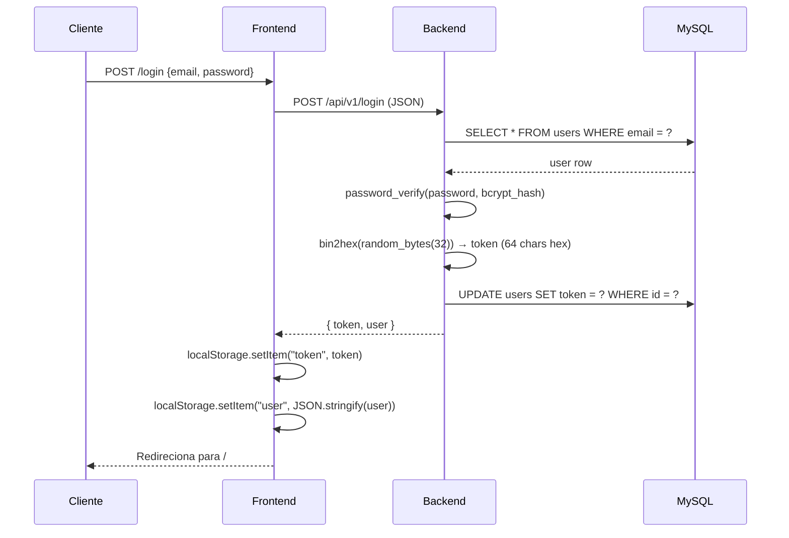

# 05 — Segurança

## Autenticação por Token UUID

### Fluxo de Login



### Token

| Propriedade | Detalhe |
|-------------|---------|
| Formato | 64 caracteres hexadecimais (`bin2hex(random_bytes(32))`) |
| Armazenamento | Tabela `users.token` no MySQL (única sessão ativa por usuário) |
| Persistência no cliente | `localStorage` |
| Renovação | Novo token gerado a cada login; logout invalida o token atual |
| Sem expiração temporal | Token válido até logout explícito ou novo login |

### Verificação (a cada request autenticado)

```
1. TokenAuthMiddleware extrai Bearer token do header Authorization
2. TokenAuthService::validateToken() → SELECT * FROM users WHERE token = ?
3. Se não encontrado → 401 "Token inválido ou expirado"
4. Se encontrado → injeta user_id + company_id + role no request
5. TenantMiddleware verifica que company_id está presente → 403 se ausente
```

---

## Autorização (Roles)

| Role | Descrição | Acesso |
|------|-----------|--------|
| `Admin` | Administrador | Todos os endpoints + Usuários, Auditoria, Logs |
| `Usuário` | Operador | Painel, Cotações, Contratações, Rastreamento, Transportadoras |

### Verificação de role nos controllers

```php
// Exemplo em UserController
$role = $request->attributes->get('user_role');
if ($role !== 'Admin') {
    return response()->json(['message' => 'Acesso negado'], 403);
}
```

---

## Tenant Isolation (Multi-tenant)

Toda operação de leitura e escrita é automaticamente escopada por `company_id`.

```
TokenAuthMiddleware injeta company_id do token no request
                    ↓
Todos os repositórios usam company_id em toda query
                    ↓
Usuário nunca visualiza dados de outra empresa
```

**Exemplo no repositório:**
```php
// EloquentQuotationRepository
public function findByCompany(string $companyId): array {
    return QuotationModel::where('company_id', $companyId)->get()->...
}
```

**Princípio:** nenhum endpoint retorna dados sem filtrar por `company_id`. Um usuário com token válido de empresa A **nunca** acessa dados da empresa B.

---

## Senhas

| Aspecto | Implementação |
|---------|--------------|
| Algoritmo | `PASSWORD_BCRYPT` via `password_hash()` do PHP |
| Rounds | 12 (configurado em `.env` como `BCRYPT_ROUNDS=12`) |
| Verificação | `password_verify($input, $hash)` |
| Sem política de complexidade no login | Senhas legadas continuam funcionando |

---

## Middleware Stack (ordem de execução)

```
Requisição HTTP
    ↓
ForceJsonMiddleware
    → Força Content-Type: application/json
    → Adiciona headers CORS (Access-Control-Allow-Origin, Methods, Headers)
    ↓
TokenAuthMiddleware
    → Valida Bearer token
    → Injeta user_id, company_id, user_role no request
    → 401 se token ausente ou inválido
    ↓
TenantMiddleware
    → Verifica que company_id está presente no request
    → 403 se ausente (não deveria ocorrer após TokenAuth)
    ↓
Controller
```

---

## Logout

```php
// TokenAuthService::logout()
public function logout(string $token): void {
    $user = $this->userRepository->findByToken($token);
    if ($user) {
        $this->userRepository->setToken($user->id, null); // token = NULL no banco
    }
}
```

O token é imediatamente invalidado: qualquer requisição subsequente com o mesmo token retorna 401.

---

## Proteções de Produção

| Proteção | Status | Local |
|----------|--------|-------|
| Senhas bcrypt (12 rounds) | ✅ | `password.php` / `BCRYPT_ROUNDS=12` |
| Token aleatório (random_bytes) | ✅ | `TokenAuthService.php` |
| Tenant isolation por company_id | ✅ | `TenantMiddleware.php` + todos os repos |
| UUID como chave primária (não sequencial) | ✅ | Todas as migrations |
| CORS configurado | ✅ | `ForceJsonMiddleware.php` |
| Headers JSON forçados | ✅ | `ForceJsonMiddleware.php` |
| Verificação de role por controller | ✅ | Controllers Admin-only |
| Sessão única por usuário | ✅ | `users.token` (coluna única) |

---

## Considerações e Limitações

| Item | Situação | Recomendação futura |
|------|----------|---------------------|
| Rate limiting | Não implementado | Adicionar Laravel throttle middleware |
| Token sem expiração temporal | Token válido indefinidamente até logout | Adicionar `token_expires_at` com TTL |
| HTTPS | Depende do ambiente de deploy | Obrigatório em produção |
| Sessão única | Novo login derruba sessão anterior | Comportamento intencional |
| Armazenamento em localStorage | Vulnerável a XSS | Migrar para httpOnly cookies em produção |
